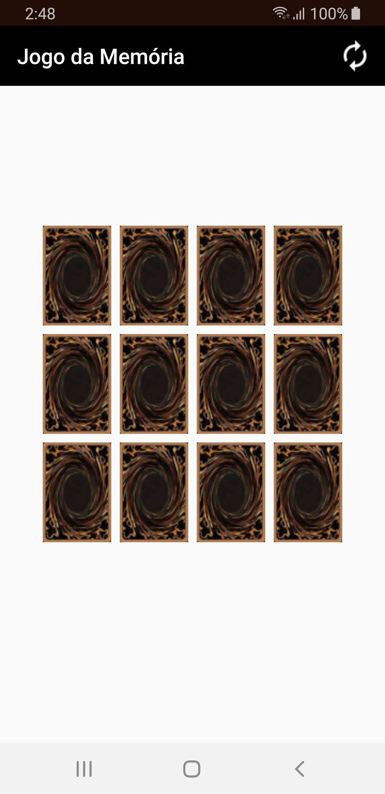
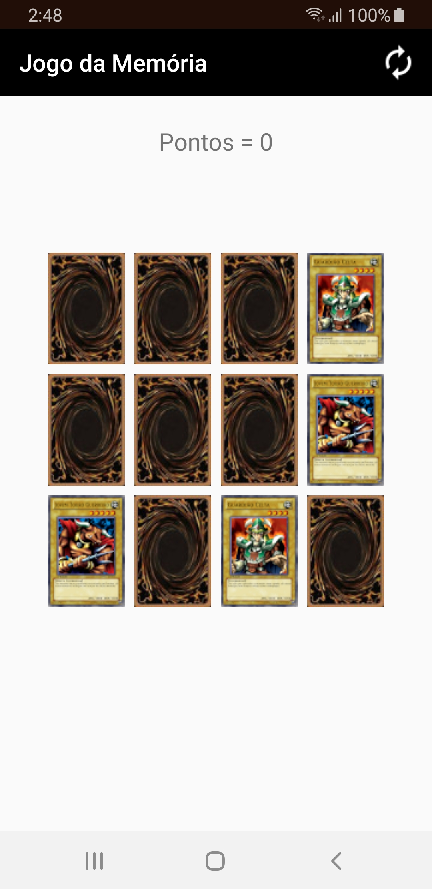

# Exemplo Jogo da Memória
Neste jogo da memória várias imagens aparecem na tela "viradas para baixo” e o usuário precisa encontrar pares que combinam quando virarem, cada erro perde 1 ponto e acerto soma 1 ponto.

 

### Licença
Este repositório está disponível sob a licença [Mozilla Public License, version 2.0](https://github.com/jhonatasrm/exemplo-jogo-da-memoria/blob/master/LICENSE)
